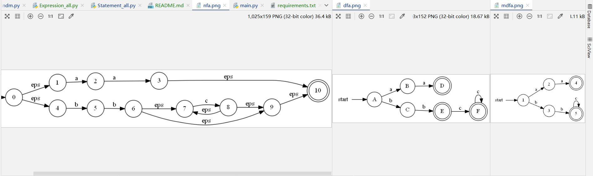
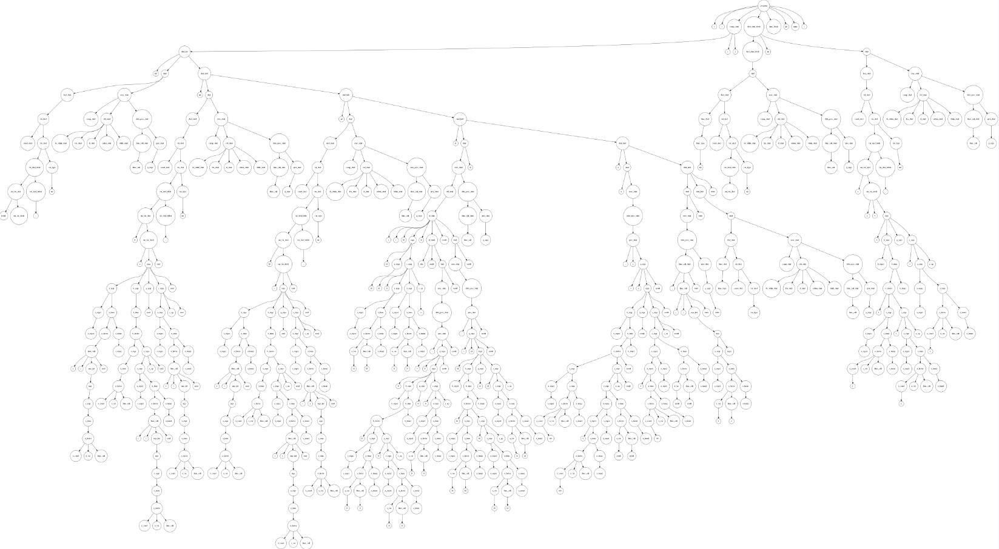
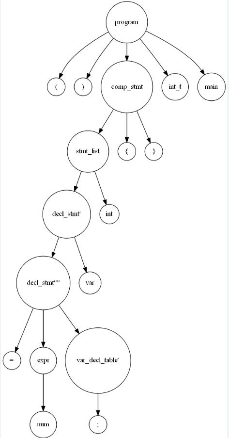

# 编译原理课设
## 一、主要功能
### 1、编译功能
- RE->NFA->DFA->MinDFA
  - 自动机可视化
- 词法分析
  - 有限自动机
- 语法分析
  - 递归下降法
    - 语法树可视化(含有无效分支)
  - 预测分析表法
    - 语法树可视化(不含无效分支)
    - 表达式与语句联合分析
  - 算符优先分析(算法验证版)
    - 只支持简单算术表达式
- 语义分析及中间代码生成
  - 语法制导翻译(基于语法树)
- 解释器
### 2、图形界面
- pyqt5
## 二、目录说明
```text
sample-compiler  # 根目录
├─ README.md  # readme
├─ help.docx  # 帮助手册
├─ main.py  # 图形化界面入口
├─ requirements.txt  # 依赖包
├─ someFunc  # 编译前端
│    ├─ input.c
│    ├─ input_temp.c
│    ├─ lexical  # 词法分析
│    │    └─ Automata.py
│    ├─ parser  # 语法分析
│    │    ├─ forecastTable  # 预测分析表法
│    │    └─ recursiveDescent  # 递归下降法
│    ├─ re2mdfa  # 正规式->不确定有限状态机-确定有限状态机-MinDFA
│    │    ├─ Rndm.py  # 生成器主程序
│    │    ├─ out  # 生成的图片
│    │    └─ template.dot  # dot模板
│    ├─ semanticAndMidCode  # 语义分析及中间代码生成
│    │    └─ GrammaticalGuidance.py  # 语法制导翻译
│    ├─ test.py  # 编译前端测试入口
│    ├─ testfiles  # 一些测试文件
│    └─ treePic  # 递归语法树图
├─ subui.py  # 子窗口实现
├─ subui.ui  # 子窗口设计
├─ ui.py  # 主窗口实现
└─ ui.ui  # 主窗口设计
```
## 三、示例
### 1、 RE->NFA->DFA->MinDFA
自动机可视化:  

### 2、 词法分析
输出结果:  
- Note: 格式形如`'token源'(种别码)[行位置, 列位置]`
```text
'int_t'(2)[0, 6]
'main'(var)[0, 11]
'('(4)[0, 12]
')'(4)[0, 13]
'{'(4)[0, 14]
'for'(2)[1, 8]
'('(4)[1, 8]
'i'(var)[1, 10]
......
```
### 3、 语法分析
#### 3.1、 递归下降法
递归语法树:  
```text
program
├── (
├── )
├── comp_stmt
│   ├── stmt_list
│   │   ├── int
│   │   ├── stmt
│   │   │   ├── decl_stmt
│   │   │   │   └── val_decl
│   │   │   │       ├── const_decl
│   │   │   │       └── var_decl
│   │   │   │           ├── var_decl_table
│   │   │   │           │   ├── sin_var_decl
│   │   │   │           │   │   ├── i
│   │   │   │           │   │   └── sin_var_decl1
│   │   │   │           │   │       ├── 0
│   │   │   │           │   │       ├── =
│   │   │   │           │   │       └── expr
│   │   │   │           │   │           ├── 0
│   │   │   │           │   │           ├── b_expr
│   │   │   │           │   │           │   ├── b_expr1
│   │   │   │           │   │           │   └── b_item
...还有剩下90%就不放了，电脑太卡了...
```

#### 3.2、 预测分析表法
LL(1)文法:  
```text
                 stmt -> decl_stmt
                       | exec_stmt
            decl_stmt -> float decl_stmt'''
                       | char decl_stmt''
                       | int decl_stmt'
                       | const_decl
                       | void var ( func_decl_para_list ) ;
           const_decl -> const const_type const_decl_table
           const_type -> int
                       | char
                       | float
     const_decl_table -> var = num const_decl_table'
       var_decl_table -> sin_var_decl var_decl_table'
         sin_var_decl -> var sin_var_decl'
  func_decl_para_list -> func_decl_para
                       | eps
       func_decl_para -> float func_decl_para'''
......
```
First-Follow集:  
```text
a_expr	false	( num var	&& ) , ; ||
a_expr'	false	+ -
a_expr''	true	+ - eps	!= && ) , ; < <= == > >= ||
a_factor	false	( num var	!= % && ) * + , - / ; < <= == > >= ||
a_factor'	true	( eps	!= % && ) * + , - / ; < <= == > >= ||
a_item	false	( num var	!= && ) + , - ; < <= == > >= ||
a_item'	false	% * /
a_item''	true	% * / eps	!= && ) + , - ; < <= == > >= ||
args	false	! ( num var	)
args'	true	, eps	)
args_list	true	! ( num var eps	)
b_expr	false	! ( num var	&& ) , ; ||
......
```
输出结果：
- Note：可自行选择是否带日志输出
```text
......
symb:'a_item'''----stack:["a_expr''", "expr''''''''", ';', "stmt_list'", '}', 'func_block', '#']
toke:';'(4)[10, 13]----stack:['}'(4)[11, 1], '#']

symb:'a_expr'''----stack:["expr''''''''", ';', "stmt_list'", '}', 'func_block', '#']
toke:';'(4)[10, 13]----stack:['}'(4)[11, 1], '#']

symb:'expr'''''''''----stack:[';', "stmt_list'", '}', 'func_block', '#']
toke:';'(4)[10, 13]----stack:['}'(4)[11, 1], '#']

symb:';'----stack:["stmt_list'", '}', 'func_block', '#']
toke:';'(4)[10, 13]----stack:['}'(4)[11, 1], '#']
	*HIT: ;	<-	';'(4)[10, 13]

symb:'stmt_list''----stack:['}', 'func_block', '#']
toke:'}'(4)[11, 1]----stack:['#']

symb:'}'----stack:['func_block', '#']
toke:'}'(4)[11, 1]----stack:['#']
	*HIT: }	<-	'}'(4)[11, 1]
match compete!
```
语法树可视化1：
```text
program
├── (
├── )
├── comp_stmt
│   ├── stmt_list
│   │   ├── decl_stmt'
│   │   │   ├── decl_stmt''''
│   │   │   │   ├── =
│   │   │   │   ├── expr
│   │   │   │   │   └── num
│   │   │   │   └── var_decl_table'
│   │   │   │       └── ;
│   │   │   └── var
│   │   └── int
│   ├── {
│   └── }
├── int_t
└── main
```
语法树可视化2：  

#### 3.3、 算符优先法
简单的算法验证，无示例

### 4、语义分析及中间代码生成
- 语义检查
1. 变量重复定义
```text
int_t main(){
  int i;
  int i=0;
  return 0;
}

OUTPUT:
Error: Variable definition
["'i'(var)[5, 8]None", "'N'(var)[5, 10]None", "'sum'(var)[5, 14]None", "'choice'(var)[5, 25]None"]
```
2. 变量未定义使用
```text
int_t main(){
  i=0;
  return 0;
}

OUTPUT:
Error: Variable is not defined
["'j'(var)[5, 4]None"]
```
- 中间代码生成
example: test6.txt  
```text
//if
int_t main()
{
  int i,N,sum = 0,choice=0;
  N = read();
  choice=read();
  if(choice == 1) {
      for(i=1;i<=N;i=i+1)
      {
         if(i%2 == 1)
	    sum = sum+i;
      }
  }
  if(choice == 2){
//  else if(choice == 2){
      i=0;
      while(i<N){
      sum = sum + i;
      i = i + 2;
     }
   }
  write(sum);
}
```
OUTPUT:  
```text
0 ['main', '-', '-', '-']
1 ['=', '0', '-', 'sum']
2 ['=', '0', '-', 'choice']
3 ['call', 'read', '-', 'T0']
4 ['=', 'T0', '-', 'N']
5 ['call', 'read', '-', 'T1']
6 ['=', 'T1', '-', 'choice']
7 ['==', 'choice', '1', 'T2']
8 ['jnz', 'T2', '-', '10']
9 ['j', '-', '-', 'None']
10 ['=', '1', '-', 'i']
11 ['<=', 'i', 'N', 'T3']
12 ['jnz', 'T3', '-', '14']
13 ['j', '-', '-', '21']
14 ['jnz', '% 2 == 1 i', '-', '16']
15 ['j', '-', '-', '21']
16 ['+', 'i', 'sum', 'T5']
17 ['=', 'T5', '-', 'sum']
18 ['+', '1', 'i', 'T4']
19 ['=', 'T4', '-', 'i']
20 ['j', '-', '-', '13']
21 ['==', 'choice', '2', 'T6']
22 ['jnz', 'T6', '-', '24']
23 ['j', '-', '-', '33']
24 ['=', '0', '-', 'i']
25 ['<', 'i', 'N', 'T7']
26 ['jnz', 'T7', '-', '28']
27 ['j', '-', '-', '33']
28 ['+', 'i', 'sum', 'T8']
29 ['=', 'T8', '-', 'sum']
30 ['+', '2', 'i', 'T9']
31 ['=', 'T9', '-', 'i']
32 ['j', '-', '-', '25']
33 ['para', 'sum', '-', '-']
34 ['call', 'write', '-', 'T10']
35 ['sys', '-', '-', '-']
```
### 5、解释器
