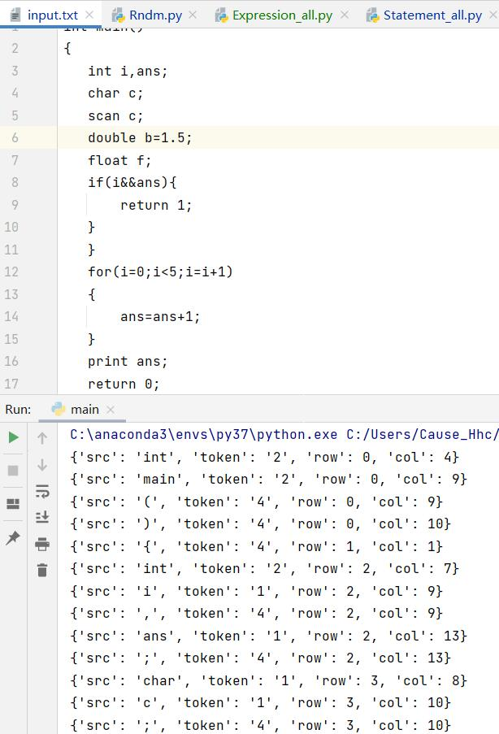
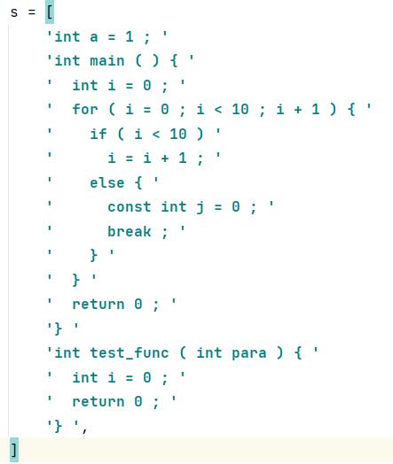
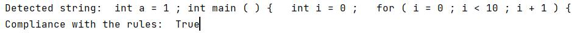

# 编译原理课设
## 目前状态
施工中...
## 主要功能
- RE->NFA->DFA->MinDFA
  - 自动机可视化
- 词法分析
  - 有限自动机
- 语法分析
  - 递归下降
  - 语法树可视化
## 目录说明
```text
sample-compiler  # 根目录
├─ README.md  # readme
├─ help.docx  # 帮助手册
├─ main.py  # 图形化界面入口
├─ requirements.txt  # 依赖包
├─ someFunc  # 编译前端
│    ├─ lexical  # 词法分析
│    │    ├─ input.txt
│    │    └─ main.py
│    ├─ parser  # 语法分析
│    │    ├─ Expression_all.py  # 表达式分析
│    │    ├─ Match_base.py  # 递归下降分析器基类
│    │    ├─ Statement_all.py  # 语句分析
│    └─ re2mdfa  # 正规式->不确定有限状态机-确定有限状态机-MinDFA
│           ├─ Rndm.py  # 生成器主程序
│           ├─ out  # 生成的图片
│           └─ template.dot  # dot模板
├─ subui.py  # 子窗口实现
├─ subui.ui  # 子窗口设计
├─ testFiles  # 一些测试文件
├─ ui.py  # 主窗口实现
└─ ui.ui  # 主窗口设计
```
## 示例
### 1、 RE->NFA->DFA->MinDFA

### 2、 词法分析

### 3、 语法分析
源程序:


由此生成的巨大的语法树...
```text
program
├── (
├── )
├── comp_stmt
│   ├── stmt_list
│   │   ├── int
│   │   ├── stmt
│   │   │   ├── decl_stmt
│   │   │   │   └── val_decl
│   │   │   │       ├── const_decl
│   │   │   │       └── var_decl
│   │   │   │           ├── var_decl_table
│   │   │   │           │   ├── sin_var_decl
│   │   │   │           │   │   ├── i
│   │   │   │           │   │   └── sin_var_decl1
│   │   │   │           │   │       ├── 0
│   │   │   │           │   │       ├── =
│   │   │   │           │   │       └── expr
│   │   │   │           │   │           ├── 0
│   │   │   │           │   │           ├── b_expr
│   │   │   │           │   │           │   ├── b_expr1
│   │   │   │           │   │           │   └── b_item
...还有剩下90%就不放了，电脑太卡了...
```
